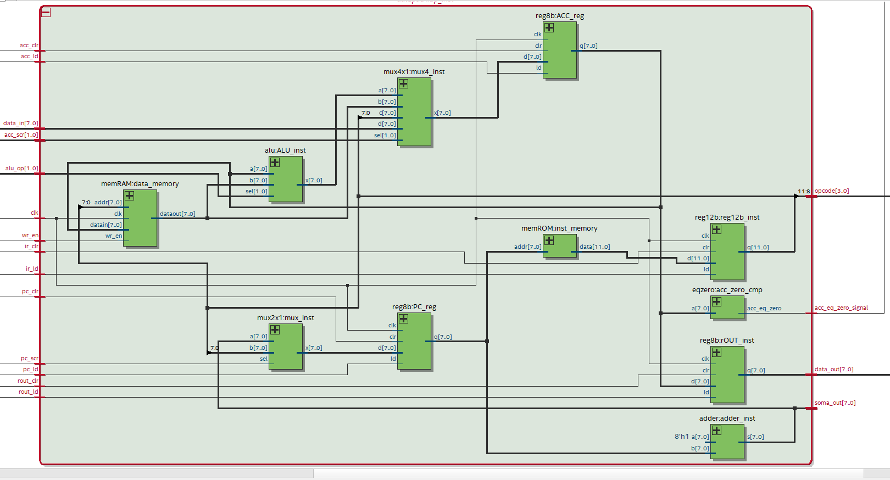
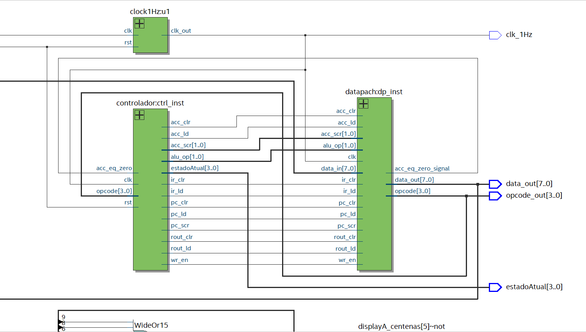

# Processador Fibonacci

## 📌 Visão Geral do Projeto

Aqui está uma visão geral dos principais componentes deste projeto:

- **Datapath**: Responsável pelas operações de processamento e movimentação de dados.
- **Controlador**: Define os sinais de controle com base no opcode das instruções.
- **Memória**: Inclui uma ROM para armazenamento de instruções e uma RAM para dados.
- **ULA (ALU)**: Executa operações aritméticas e lógicas básicas.

## 🖼️ Diagramas RTL  

Os diagramas RTL gerados pelo **Quartus** são apresentados abaixo para facilitar a compreensão da arquitetura:

### 🔹 Datapath  


### 🔹 Visão Geral  


## 🚀 Como Rodar o Projeto  

Para rodar este projeto, siga os passos abaixo:

1. **Clone o repositório**  
   ```sh
   git clone https://github.com/lucasxavier9/ProcessadorFibonacci
   cd seurepositorio
   ```
2. **Abra o Quartus e compile o projeto**
3. **Embarque na FPGA** (necessario fazer o pin planner)
   - Visualize o comportamento
5. **Simule no ModelSim**  
   - Configure os arquivos no ModelSim
   - Execute a simulação para visualizar os sinais  
 
## Melhorias Futuras  

- Implementação de um conjunto de instruções mais robusto  
- Suporte a pipeline  
- Implementação de uma interface externa para interação  

## 🤝 Contribuição

Contribuições são bem-vindas! Se você tiver sugestões de melhorias, novos projetos ou correções, sinta-se à vontade para abrir um pull request ou relatar um problema.

## 📜 Licença

Este projeto está licenciado sob a Licença MIT. Consulte o arquivo LICENSE para mais detalhes.

---
